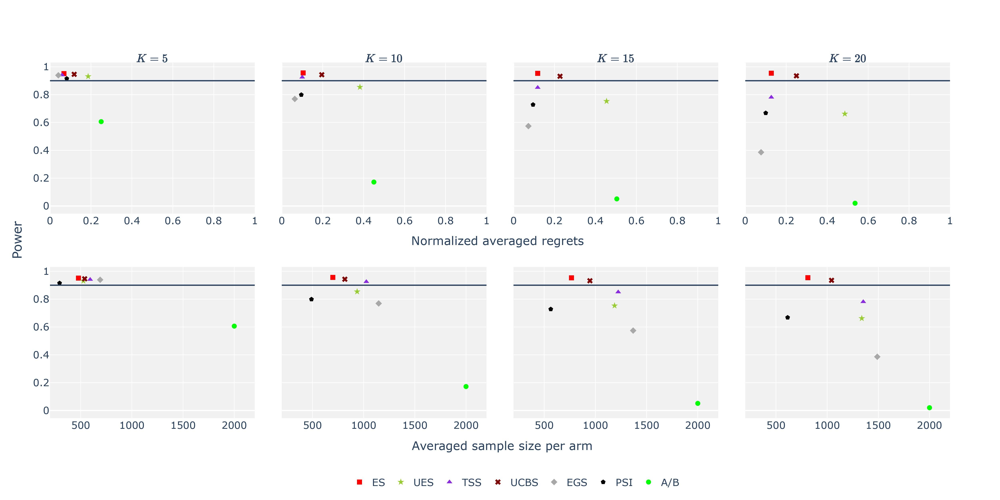
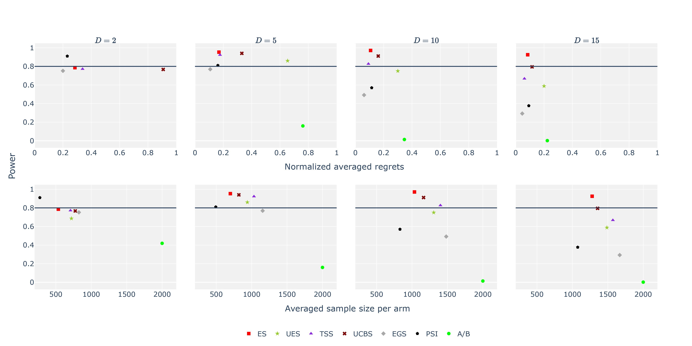
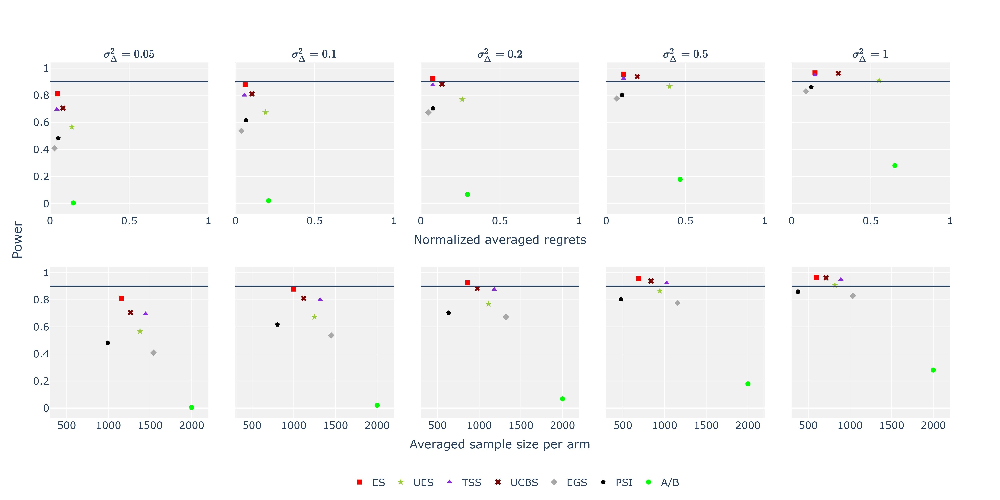

**This is code repository for algorithm MOSOPTIMA**:smiley:

### Run The Code

```
python MAB_Simulation.py --variance_list 0.16
```

### Description of the function of each file

**MAB_Simulation.py :** Tune the parameters of algorithm and run the simulation

**Run_Simulation.py :** The specific implementation of the simulation process

**Environment.py :** Define the environment class 

**Arm.py :** Define the arm class and algorithms related to preprocessing arms

**Pareto.py :** Implement the algorithm for getting the optimal pareto set 

**Pareto_UCB1.py :** Implement the algorithm for getting the optimal pareto set using Pareto_UCB1 algorithm

**Read_result.py :** Read the results and write all the result into a file

**Exp_multiArm :** Record the results

### Result_Figure



